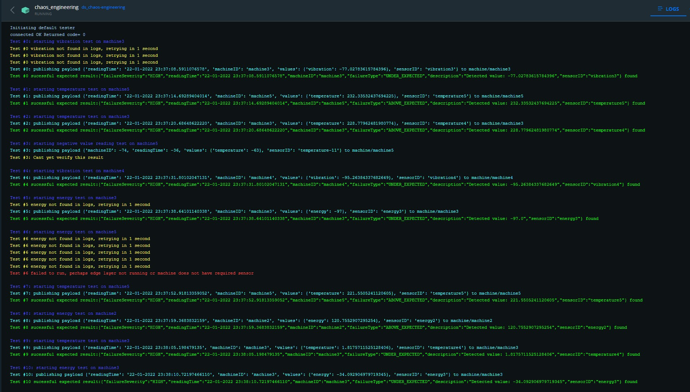

# Chaos Engineering

## Instalation

This project requires python version of at least 3.6, to install the dependecies run

```bash
$ pip install -r requirements.txt
```

## Executing

To run the tests the edge and failure layers need to be running, the easier way to accomplish this is to run our docker setup using docker compose on the root folder:

```bash
$ docker-compose up -d
```

We recommend you use [docker desktop](https://www.docker.com/products/docker-desktop), or another docker GUI application such as the vscode extention, in order to easily disable and enable containers. For this vertical's purposes, only the **edge** and **failure-service** containers need to be running. The container **chaos-engineering** runs our default tester, this script runs random tests on random machines on a time interval.

Alternatively you can run them manually by downloading and running [mosquitto](https://mosquitto.org/) on port 1883, and then following vertical 1 and 3 setup instructions.

### Running individual tests directly
Tests can be ran individualy without a test manager, to do this you can run any of the files with a **test_** prefix on the src folder of this vertical. As an example from the chaos-engineering folder you can run:

```bash
$ python3 src/test_temperature.py
```

Change **temperature** for the test you want to run.

### Running individual tests using the manual tester
The manual tester provides a command line interface which lists the existing tests and lets you choose specificy parameters such as how many times you wan to run the test and the delay between tests.

The manual tester is still a work in progress. To launch the manual tester you can run:
```bash
$ python3 src/manual_tester.py
```

### Running tests using the default tester(Recommended)
This is the test manager used on our docker container. This script launches random tests on random machines on a time interval and displays all information in the command line. The machines the tests are conducted on, and other variables such as time between tests, are easily configurable on the file **src/static/config.json** in the chaos_engineering folder. You can run this tester with:

```bash
$ python3 src/default_tester.py
```

### Denial of service
We include a script that allows us to test a denial of service attack on the mosquitto service. To run this script use:

```bash
$ python3 src/denial_of_service.py
```

It is important you run this command from the chaos_engineering folder so that the tester knows where to get the config.json file.

## Default tester output on our docker container



## Upcoming changes
More tests and test statistics for the default tester.
