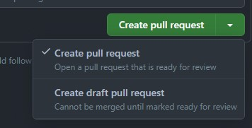
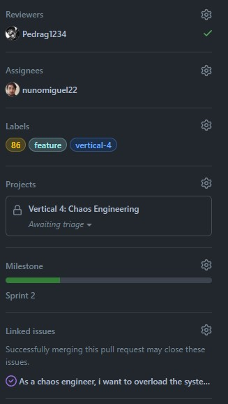
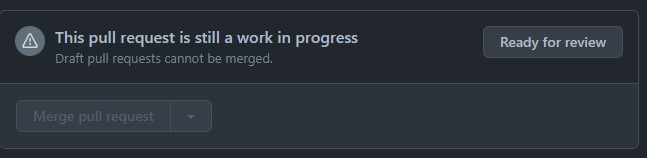

# V4 Chaos Enginneering Workflow

## Create a branch based on the issue and publish it

``` git pull ```

``` git checkout V4-ChaosEngineering ```

``` git checkout -b V4-feature/my-branch ```

``` git push --set-upstream origin V4-feature/my-branch ```

## Make your first commit and create your pull request

Commit your first change, such as creating the script skeleton:

``` git add . ```

``` git commit -m 'feature: my script' ```

``` git push ```

Create a new **draft** pull request:



Set a name and create it, then edit the pull request by adding assignees, labels, projects, milestones and linked issues based on your issue.




## Make commits to your branch

Before committing check if your code passes the pylint check. You can check by installing pylint locally with ``` sudo apt install pylint ``` or ``` pip install pylint ``` and running 
``` pylint <filename>.py ```.

Issues with identation and whitespaces can be resolved automatically using autopep8. Install using ``` sudo apt install python3-autopep8 ``` or ``` pip install autopep8 ```. Run ``` autopep8 --in-place --aggressive <filename>.py ``` to have autopep8 fix whitespaces and identation issues.

Once the pylint passes your code without issues you can push your commit.

## Mark your pull request as ready for review when done



Wait for the review, make changes if not approved. If approved your pull request will be merged and your branch deleted. Start over with a new issue.
